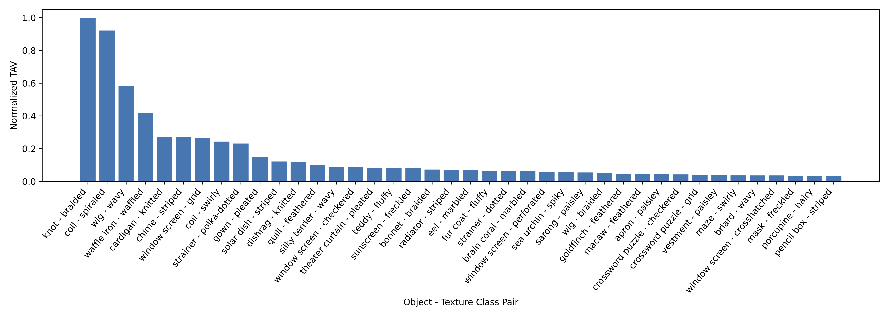

# Err on the Side of Texture: Texture Bias on Real Data

Check out our paper [here](https://arxiv.org/abs/2412.10597) which has been accepted to IEEE Secure and Trustworthy Machine Learning (SaTML) 2025!

In this work, we assess the effect of texture bias on real data decisions by exploring two key components:

1. **Quantifying the Relationship Between Textures and Objects**  
   We first measure the degree to which a model associates textures with object classes. This is done using texture data to generate *Texture-Object Association Values (TAV)*. The figure below shows the strength of the top 50 associations for a ResNet-50 model trained on ImageNet:

   


2. **Identifying Textures Present in Object Images**  
   Using the learned associations, we identify which textures are present in real-world images. This allows us to understand how texture influences model predictions on standard benchmarks. The following figure shows images from the ImageNet validation set that are identified as having a grid texture.

   

---

## Getting Started

### 1. Download the Data

Please follow the instructions in [`datasets/README.md`](datasets/README.md) to download and prepare the datasets.

### 2. Generate the Texture-Association Vector (TAV)

To compute the TAV using your model of choice (e.g., `resnet50`), run:

```bash
python3 main.py --model_name {MODEL_NAME_HERE} --dataset ptd
```

This will store the TAV results in the `results/` directory.

### 3. Compute the Texture Identification (TID) on a Dataset

Once the TAV has been computed, you can run TID on any dataset using:

```bash
python3 main.py --model_name {MODEL_NAME_HERE} --dataset {DATASET_NAME_HERE}
```

The currently supported datasets include:
- `imagenet-val`
- `imagenet-a`

---

## Citation

If you use this work in your research, please cite the following paper:

```bibtex
@article{hoak2024err,
  title={Err on the Side of Texture: Texture Bias on Real Data},
  author={Hoak, Blaine and Sheatsley, Ryan and McDaniel, Patrick},
  journal={arXiv preprint arXiv:2412.10597},
  year={2024}
}
```
